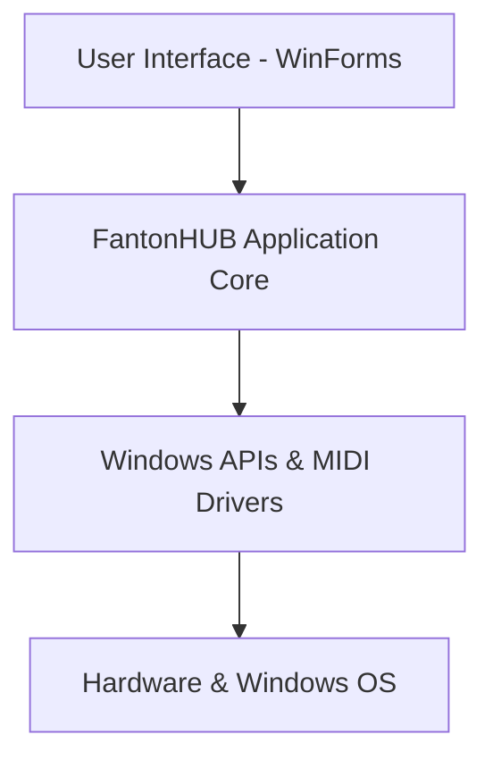

# FantonHUB (CmcMidiRouter) - Documentação de Arquitetura

Este documento descreve a arquitetura de software do projeto **FantonHUB** (CmcMidiRouter), que atua como um roteador de mensagens MIDI dinâmico e de latência zero para controladores físicos da linha **Steinberg CMC** (como o CMC-FD e CMC-PD). Ele resolve problemas de embaralhamento de nomes de portas MIDI no Windows através da identificação física dos dispositivos usando dados de VID (Vendor ID), PID (Product ID) e números de série USB, gerenciando a conexão lógica dinamicamente com suporte a Hotplug (conexão e desconexão em tempo de execução).

O diagrama de arquitetura detalhado está disponível no arquivo [FantonHUB-Arquitetura.drawio](file:///g:/Meu%20Drive/X/GitHub%20-%20robsonbmartins/MIDI-Routing-USD-VID-PID/FantonHUB-Arquitetura.drawio). Você pode abri-lo diretamente no [draw.io](https://app.diagrams.net/).

---

## Estrutura de Camadas

A arquitetura do FantonHUB é dividida em 4 camadas lógicas:

### 1. Hardware & Windows OS
Representa a camada física e o sistema operacional subjacente.
*   **Steinberg CMC Hardware**: Os controladores físicos USB (ex: `CMC-FD` com PID `150F` e VID Yamaha `0499`).
*   **USB Bus / Hubs**: Barramento USB físico que gerencia a comunicação PnP (Plug and Play).
*   **Windows OS PnP System**: O sistema operacional, que gerencia os drivers de barramento e expõe eventos globais quando o hardware é alterado.

### 2. Windows APIs & Drivers
Interfaces nativas e drivers de baixo nível do Windows usados pela aplicação para controle de hardware e áudio.
*   **SetupAPI & CfgMgr32** (via `Vanara.PInvoke`): Utilizado para ler diretamente as propriedades físicas dos dispositivos USB (como o `InstanceId`, número de série USB e `ContainerID`), permitindo identificar os controladores de forma única e ignorando os nomes genéricos que o Windows distribui.
*   **Windows Messages (WM_DEVICECHANGE)**: Mecanismo de notificação de mensagens do Windows que envia eventos instantâneos quando um dispositivo USB é conectado ou desconectado.
*   **NAudio (WinMM MIDI API)**: Biblioteca C# usada para abrir conexões MIDI nativas de baixo nível (`midiInOpen`, `midiOutOpen`) e capturar/enviar streams de dados MIDI físicos em tempo real.
*   **teVirtualMIDI Driver**: Driver virtual MIDI de baixa latência (desenvolvido por Tobias Erichsen) que permite à aplicação criar dinamicamente portas MIDI virtuais no sistema (ex: `VM_MASTER_IN` e `VM_MASTER_OUT`) para comunicação com softwares terceiros como o VoiceMeeter.

### 3. FantonHUB Application Core
A lógica de negócio central do projeto.
*   **DeviceDiscovery**: Módulo encarregado de enumerar os dispositivos USB do sistema através da `SetupAPI`, identificando quais barramentos físicos pertencem à Steinberg (VID `0499`) e recuperando seus metadados.
*   **HiddenMessageWindow**: Uma janela WinForms invisível (subclass do `Form`) dedicada unicamente a escutar mensagens de sistema nativas do Windows (`WM_DEVICECHANGE`) para sinalizar instantaneamente a reconexão automática (Hotplug) sem loops de polling agressivos.
*   **TrayApplicationContext**: O ponto central da aplicação que controla o ciclo de vida (System Tray), gerencia os timers de debounce do hotplug e pooling de segurança, e invoca a reconstrução de rotas no roteador.
*   **MidiRouter**: Motor que gerencia o fluxo de roteamento de dados em tempo real:
    *   **Soma (Merge)**: Direciona e junta os sinais de todos os inputs físicos selecionados e os envia para a porta virtual de entrada principal (`VM_MASTER_IN`).
    *   **Broadcast (Distribuição)**: Escuta a porta virtual de saída (`VM_MASTER_OUT`) e replica as mensagens de feedback visual (LEDs, faders motorizados) para todos os controladores físicos correspondentes.
*   **DatabaseManager**: Interface com o banco de dados local **SQLite** (`cmc_router.sqlite`), que armazena de forma persistente os perfis dos dispositivos configurados, portas virtuais registradas, portas físicas ativas e as rotas lógicas de MIDI.

### 4. User Interface (UI)
Camada visual desenvolvida em C# Windows Forms.
*   **System Tray Icon**: Ícone na barra de tarefas que permite interagir rapidamente com a ferramenta através de menus de contexto (Configurações, Monitor MIDI, Visualizador de Logs e Auto-inicialização com o Windows).
*   **WinForms UI Views**:
    *   `ConfigurationForm`: Tela para configurar portas virtuais, habilitar/desabilitar rotas e associar dispositivos.
    *   `MidiMonitorForm`: Console gráfico de tráfego de dados para depuração MIDI em tempo real.
    *   `LogViewerForm`: Exibe logs detalhados do sistema (gerados pelo Serilog) para diagnóstico e auditoria.

---

## Fluxos de Dados Principais

### A. Fluxo de Roteamento de Entrada (Soma/Merge MIDI)
Este fluxo ocorre quando o usuário toca ou move um fader no hardware:
1. O controlador **CMC físico** envia um evento MIDI.
2. A API **NAudio** captura o evento por meio de `MidiIn`.
3. O `MidiRouter` recebe a mensagem no manipulador `OnCmcInputMessageReceived`.
4. O roteador consulta o `DatabaseManager` para obter as rotas de destino configuradas.
5. As mensagens são formatadas em bytes estruturados e transmitidas à porta virtual `VM_MASTER_IN` (usando o driver `teVirtualMIDI`).

### B. Fluxo de Roteamento de Saída (Feedback Visual/Broadcast MIDI)
Este fluxo ocorre quando um software de áudio (ex: VoiceMeeter) envia feedback visual para os controladores:
1. O software envia dados MIDI para a porta virtual `VM_MASTER_OUT`.
2. A thread de leitura `VirtualPortReadLoop` (associada ao wrapper do `teVirtualMIDI`) captura o comando.
3. O `MidiRouter` consulta o banco para verificar quais outputs físicos devem receber o sinal.
4. O roteador encaminha as mensagens (incluindo SysEx ou notas curtas) para as instâncias físicas via `NAudio.MidiOut`, atualizando os LEDs e faders dos controladores físicos na mesa.

### C. Loop de Hotplug (Conexão Dinâmica)
Para garantir que a desconexão acidental de um cabo USB não interrompa a operação:
1. Um cabo USB de um CMC é desconectado ou reconectado.
2. O Windows gera um evento global do sistema.
3. O `HiddenMessageWindow` intercepta a mensagem `WM_DEVICECHANGE`.
4. Um temporizador de *debounce* de 1.5s é ativado para evitar re-verificações múltiplas em sequência rápida.
5. Ao disparar, a aplicação chama `MidiRouter.RefreshDevices()`.
6. O roteador fecha portas MIDI inválidas, varre os barramentos novamente via `DeviceDiscovery`, reabre conexões de hardware reestabelecidas e reconstrói as rotas dinâmicas automaticamente sem necessidade de reiniciar o software.
